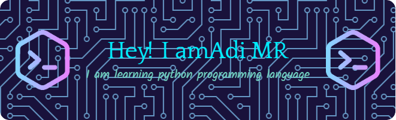

## Hi Everybody 👋 

- 👨‍🎓 I'm a student who is currently studying informatics engineering
- 🌱 I’m currently learning **python programming language**

<!-- #### skills

#### social media

##### My github stats

 -->

## 🌐 Socials:
    

# 💻 Tech Stack:

  
  
  
  
  
  
  
  
  
  
  

# 📊 GitHub Stats:
 
 

### ✍️ Random Dev Quote

###### 1. "Ngoding itu seni... seni menahan emosi saat error tanpa sebab yang jelas."
###### 2. "Ngoding tuh kayak cinta bertepuk sebelah tangan — kita udah usaha, dia tetep error."
###### 3. "Error itu biasa. Yang gak biasa tuh error muncul, padahal gak disentuh apa-apa."
---

<!-- Proudly created with GPRM ( https://gprm.itsvg.in ) -->

### 🎮 Play Game With Me

###

<picture>
  <source media="(prefers-color-scheme: dark)" srcset="https://raw.githubusercontent.com/raflyadi1125/raflyadi1125/output/pacman-contribution-graph-dark.svg">
  <source media="(prefers-color-scheme: light)" srcset="https://raw.githubusercontent.com/raflyadi1125/raflyadi1125/output/pacman-contribution-graph.svg">
    
</picture>

###

###
